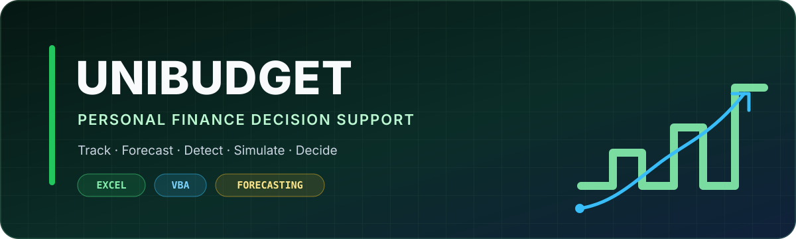
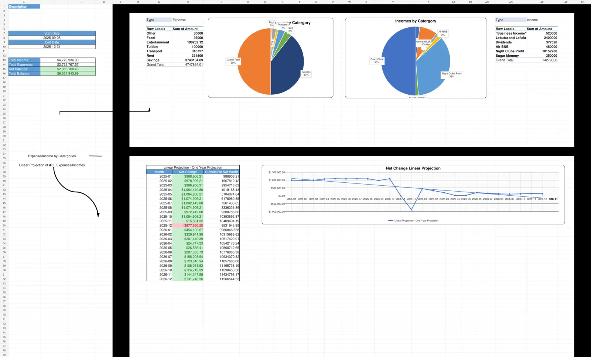
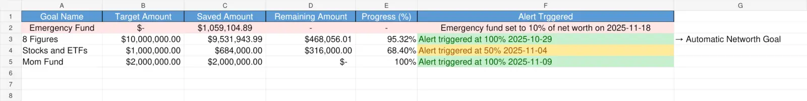
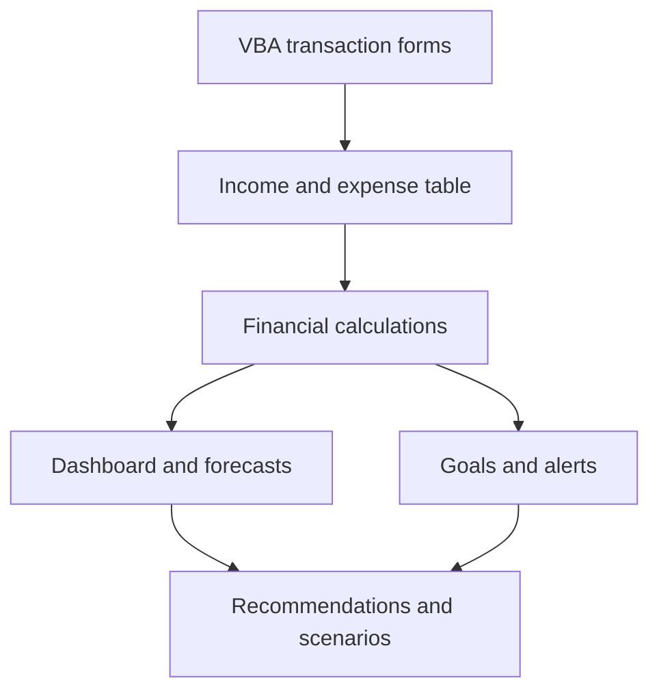

  

  <strong>A macro-enabled Excel application for recording transactions, tracking financial goals, forecasting net worth, and testing financial decisions.</strong>

  
  
  
  

## Overview

UniBudget is an Excel/VBA personal-finance platform designed to move beyond passive expense logging. The workbook connects transaction data, savings goals, financial projections, exception detection, and what-if analysis so users can understand both their current position and the consequences of future decisions.

VBA forms provide guided data entry while formulas, PivotTables, charts, and macros automate reporting and analysis. The result behaves more like a lightweight desktop application than a conventional spreadsheet.

The included workbook uses fictional demonstration data. It contains no real personal or financial information.

## Download and run

[**Download UniBudget.xlsm**](UniBudget.xlsm)

1. Download the workbook and open it in the desktop version of Microsoft Excel.
2. If Excel displays a security warning, select **Enable Content** to allow the VBA features to run.
3. Use the workbook's buttons and forms to add transactions, create goals, refresh the dashboard, and run scenarios.

> Excel for the web can display the workbook, but it cannot run its VBA macros. Use desktop Excel for the complete experience.

## Interface

### Financial dashboard

### Savings goals

## Core capabilities

| Capability | Implementation |
|---|---|
| Transaction management | Records dated income and expenses with items, categories, descriptions, types, and amounts |
| Financial dashboard | Summarizes income, expenses, net balance, category allocation, and historical performance |
| Goal tracking | Tracks target, saved, remaining, and completion percentages for financial goals |
| Net-worth forecasting | Extends monthly results into a one-year linear projection |
| Emergency-fund automation | Creates or updates an emergency-fund target based on current net worth |
| Exception detection | Flags unusually high expenses in the most recent month |
| Scenario analysis | Generates a shock expense and evaluates its effect on savings and net worth |
| Recommendations | Produces context-aware budgeting and savings guidance from current results |
| Reporting | Refreshes the model and exports a fixed-format PDF report |

## System flow

## Workbook architecture

| Worksheet | Responsibility |
|---|---|
| `Expenses&Incomes` | Source transaction table and guided entry controls |
| `Goals` | Savings targets, progress calculations, and alert history |
| `Dashboard` | Filters, KPIs, PivotTables, category charts, projections, and decision tools |

For the component and data-flow breakdown, see [System Architecture](docs/architecture.md).

## Technical highlights

- Macro-enabled `.xlsm` architecture with three custom VBA forms
- Nineteen worksheet controls connected to data-entry, navigation, refresh, and analysis workflows
- Two PivotTables and three linked financial charts
- Category-level income and expense summaries
- Goal progress calculations driven by transaction records
- Conditional formatting for progress, alerts, and projection changes
- Automated month-extension logic for forward projections
- PDF reporting through Excel's fixed-format export
- No external workbook links

## VBA automation

| Component | Responsibility |
|---|---|
| `AddItemForm` | Adds categorized income or expense transactions |
| `SavingsForm` | Creates a financial goal and its target amount |
| `OutputForm` | Collects reporting inputs and filters |
| `RefreshAll` | Refreshes calculations, PivotTables, and analytical outputs |
| `ManageEmergencyFund` | Creates or updates an emergency-fund goal and transfer |
| `DetectUnexpectedExpenses_MostRecentMonth` | Detects unusually high recent expenses |
| `RunShockExpenseScenario` | Tests the effect of a generated shock expense |
| `ExtendDashboardMonths` | Extends the forward projection period |
| `CheckGoals` | Evaluates goal progress and completion thresholds |

## Design decisions

- **Guided inputs.** Forms reduce inconsistent categories and accidental worksheet damage.
- **Connected calculations.** A transaction can affect the dashboard, goal progress, emergency fund, projections, and recommendations.
- **Decision support.** Exception detection and scenario analysis help users act on the data rather than only review it.
- **Explainable outputs.** The financial logic remains visible through formulas, tables, and chart source ranges.

## Project status

| Component | Status |
|---|---|
| Transaction and goal workflows | Complete |
| Dashboard, projections, and charts | Complete |
| Scenario and recommendation macros | Complete |
| Portfolio documentation | Complete |
| Public demo workbook | Complete |
| Pivot source-range optimization | Planned |
| Exported VBA source modules | Planned |

## Planned improvements

- Limit analytical source ranges to the populated dataset for a smaller PivotTable cache
- Export VBA modules as reviewable `.bas` and `.frm` files
- Add formula and macro test cases for boundary conditions
- Publish a versioned Excel release with a generated PDF example

## Disclaimer

UniBudget is an educational decision-support project. Its automated recommendations are general guidance and are not professional financial advice.

## Author

Built by [Rayan Harb](https://github.com/rayan-harb).
