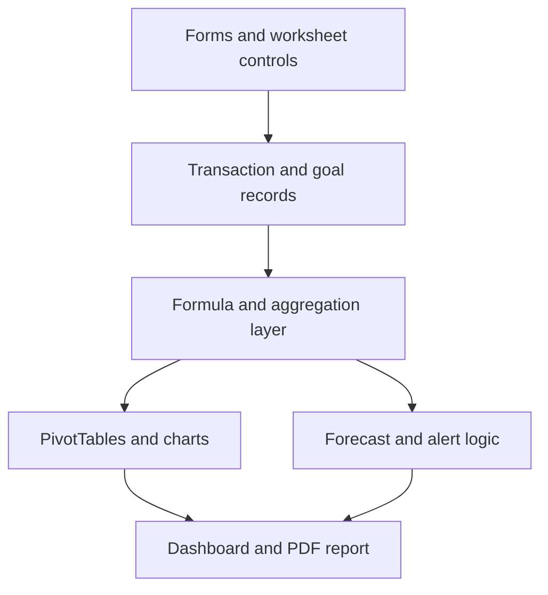

# UniBudget System Architecture

## Purpose

UniBudget combines transaction capture, goal management, financial reporting, and scenario analysis in a single Excel/VBA application.

## Component model

## Data layer

### Transaction records

The `BudgetData` table stores each transaction using six fields:

| Field | Purpose |
|---|---|
| Date | Transaction date and period filtering |
| Item | Named source or use of funds |
| Category | Income, savings, or expense classification |
| Description | Supporting transaction context |
| Type | Income or expense sign logic |
| Amount | Numeric transaction value |

### Goal records

The goal model stores target and saved amounts, calculates the remaining balance and progress percentage, and records milestone alerts.

## Calculation layer

The workbook calculates:

- Total income and expenses for a selected period
- Net balance and cumulative net worth
- Category-level income and expense totals
- Goal balances and completion percentages
- Monthly net change and forward net-worth projections
- Emergency-fund targets based on current net worth
- Shock-expense coverage and post-shock net worth

## Automation layer

VBA owns the guided and stateful workflows:

- Adding income and expense transactions
- Adding savings goals
- Applying dashboard reporting inputs
- Refreshing tables and charts
- Clearing filters and extending forecast months
- Detecting unusual recent expenses
- Creating or updating the emergency fund
- Running shock-expense scenarios
- Checking goal thresholds and exporting PDF reports

## Presentation layer

The dashboard presents:

- Date-filtered income and expense totals
- Net balance and total balance
- Income and expense category allocations
- Monthly projections and cumulative net worth
- Goal status and scenario tools

## Performance note

The portfolio release will bound analytical source ranges to the populated dataset. This reduces the PivotTable cache and keeps the workbook responsive without changing the financial model.
